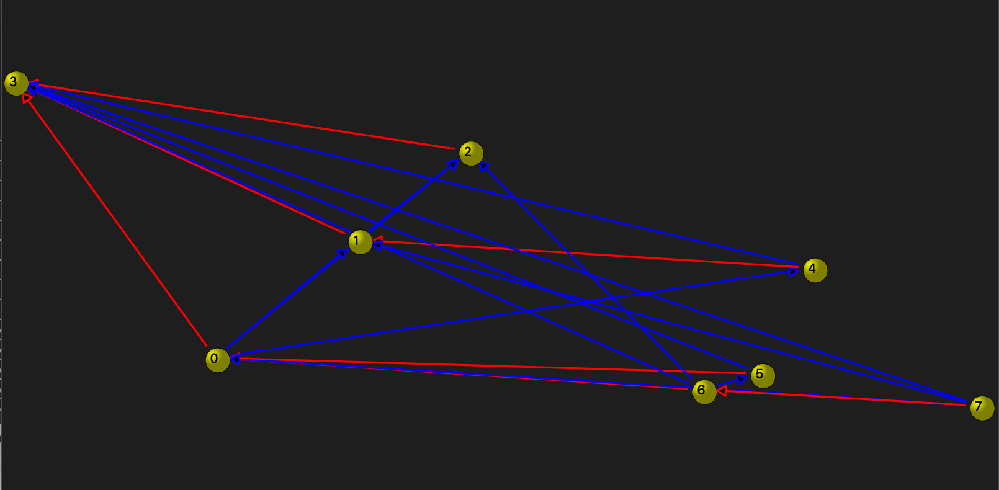

  
# Left Distributive Algebras and Elementary Embeddings
With this program I added a graph, node, and edge class from Qt to visually represent Dr. Cramer's work on embeddings and left distributive algebras.  
### Motivation
During my short time assisting Dr. Cramer I was able to study some of the theory behind what we were doing, but mostly I was responsible for finding some way to help
Dr. Cramer see what was happening with the program that he had already written. 
### Tech Stack
* C++
* QT
### Resources
* <a href="references/Cramer_2019.pdf">Cramer S., Algebraic properties of elementary embeddings, Higher Recursion Theory and Set Theory, Singapore, 2019</a>
* <a href="references/Dougherty_Jech_97.pdf">Dougherty R., Jech T., Left-Distributive Embedding Algebras, Electronic Research Announcements of the American Mathematical Society, 1997, 3, 28-37
* <a href="references/Laver_Miller_2011.pdf">Laver R., Miller S.K., Left division in the free left distributive algebra on one generator, J. Pure Appl. Algebra, 2011,
215(3), 276–282</a>
* <a href="references/Laver_Miller_2013.pdf">Laver R., Miller S.K., The free one-generated left distributive algebra: Basics and a simplified proof of the division algorithm, Cent. Eur. J. Math, 2013, 11(12), 2150-2175</a>

